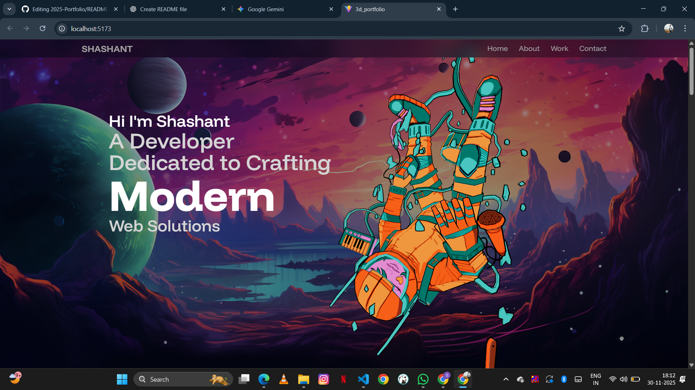
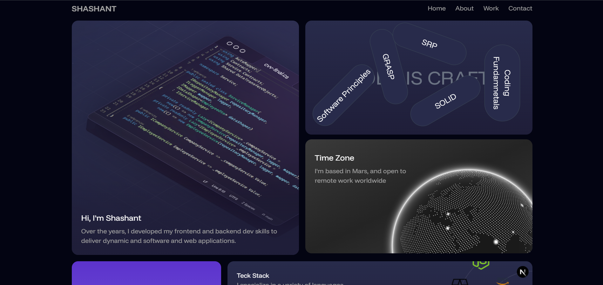
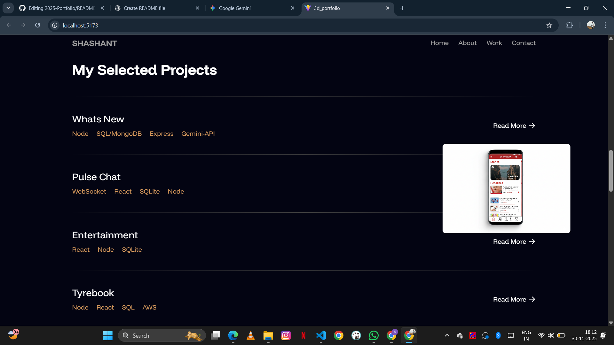
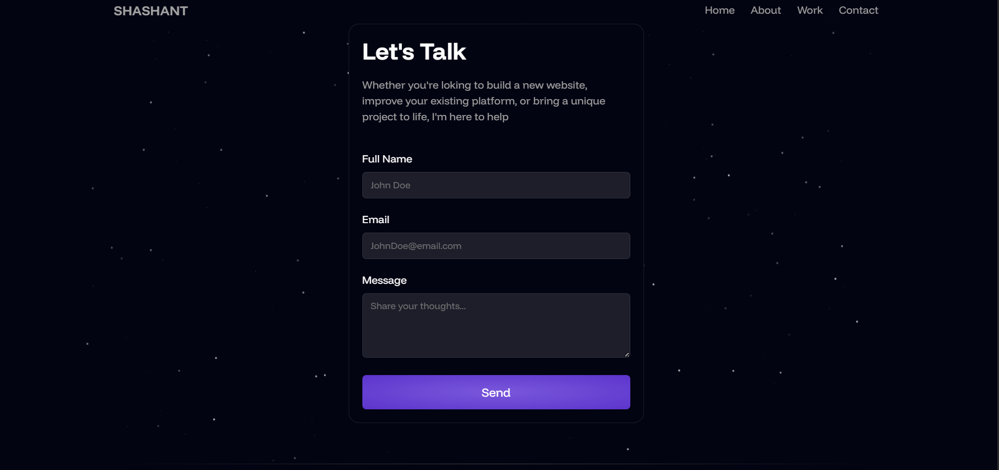

# Portfolio — Shashant Kashyap

A clean, modern and responsive personal portfolio website built using **React**, **Vite**, and **Tailwind CSS**.

Live Demo: *(Add your deployed link here)*  
Example: https://your-portfolio-url.com

---

## 📌 About the Project

This is my personal portfolio for 2025 — designed to showcase:

- My Skills  
- My Projects  
- My Experience  
- My Resume  
- Ways to Contact Me  

The goal is to create a fast, minimal and professional online identity.

---

## 🧠 Tech Used

- **React.js**  
- **Vite**  
- **Tailwind CSS**  
- **JavaScript (ES6+)**  
- **Responsive Design**  

---

## 📁 Folder Structure
Portfolio/

├── src/

│ ├── App.jsx

│ ├── main.jsx

│ ├── index.css

│ ├── assets/

│ ├── components/

│ ├── sections/

│ └── data/

├── index.html

├── package.json

├── tailwind.config.js 

├── vite.config.js 

└── README.md 

---

## 🚀 Features

- Fully responsive  
- Clean UI & modern layout  
- Smooth transitions  
- Simple component architecture  
- Easy to customize  
- Fast load times (Vite bundler)  

---

## 📸 Screenshots

- Home / Hero Section
  
- About Section
  
- Projects Showcase
  
- Contact Page
  

---

## 🌎 Deployment

This portfolio can be deployed on:

- **Vercel** 

Just build the project and upload the `dist/` folder.

---

## 📬 Contact

**👤 Shashant Kashyap**  
GitHub: https://github.com/Shashantkashyap  
Email: *Shashant.kashyap999@gmail.com*  

---

⭐ **If you like this portfolio, please give the repo a star!**

